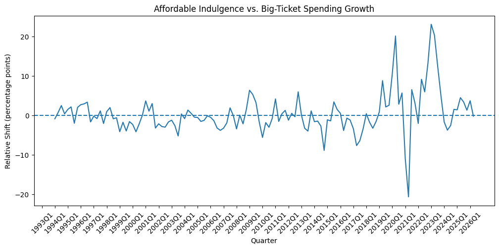
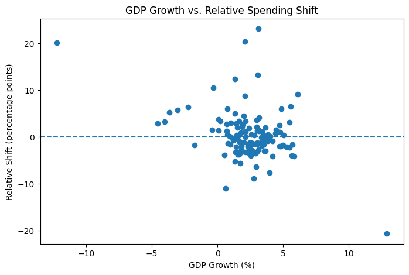
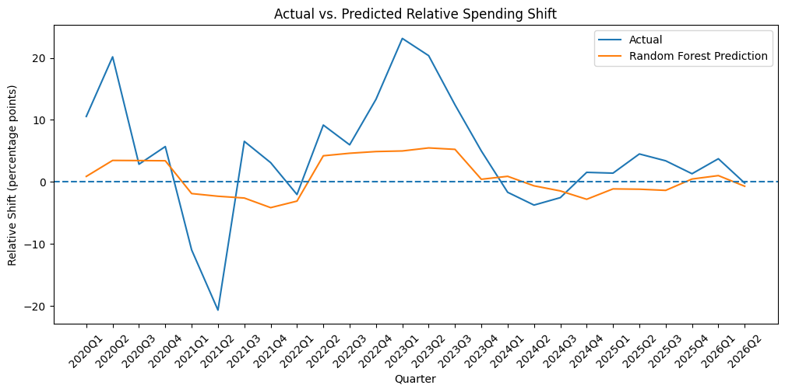

# lipstick-effect-canada

## Overview
An econometric and machine learning analysis of whether Canadian consumers shift discretionary spending toward affordable indulgences during periods of economic distress.

The "lipstick effect" is the idea that during periods of economic distress, consumers may reduce spending on expensive discretionary goods while continuing to spend on smaller, more affordable indulgences.

This project investigates whether this pattern appears in Canadian consumer spending data. Using quarterly consumption and macroeconomic data, I examine whether spending growth shifts from big-ticket goods toward affordable indulgences when economic conditions weaken.

The analysis combines econometric methods with machine learning to examine both the statistical relationships between economic conditions and spending behaviour and their ability to predict changes in relative spending patterns.

## Research Question

**Do consumers shift discretionary spending from big-ticket goods toward affordable indulgences during periods of economic distress?**

To measure this, I construct a **Relative Shift** variable:

**Relative Shift = Affordable Indulgence Spending Growth − Big-Ticket Spending Growth**

A positive Relative Shift indicates that affordable indulgences are growing faster than big-ticket spending, while a negative value indicates the opposite.

### Relative Spending Shift Over Time

## Data

The analysis uses Canadian quarterly data spanning the 1990s through 2026.

### Consumer Spending
Household final consumption expenditure data from Statistics Canada is used to measure spending across discretionary consumption categories.

Selected categories are classified into two main groups:

- **Affordable indulgences:** categories such as personal grooming services, personal care products, cinemas, games and hobbies, and jewellery.
- **Big-ticket goods:** categories such as passenger vehicles, furniture, major household appliances, and recreational durables.

Year-over-year spending growth is calculated for each individual category. The median category growth rate within each group is then used to construct quarterly Affordable Indulgence and Big-Ticket growth measures. The median is used to reduce the influence of extreme category-specific observations.

### Macroeconomic Indicators

The analysis incorporates four indicators of economic conditions:

- Unemployment rate
- CPI inflation
- Real GDP growth
- Bank of Canada policy rate

Monthly macroeconomic series are converted to quarterly frequency where necessary and aligned with the quarterly consumption data.

## Methodology

The analysis consists of three stages:

### Exploratory Analysis
- Calculate year-over-year spending growth by consumption category.
- Aggregate categories into Affordable Indulgence and Big-Ticket groups.
- Construct the Relative Shift measure.
- Examine trends, correlations, and the relationship between macroeconomic conditions and Relative Shift.

### Econometric Analysis
A multiple OLS regression estimates the relationship between Relative Shift and unemployment, inflation, GDP growth, and the Bank Rate.

Additional robustness checks:
- Excluding the COVID-19 period to determine whether extreme pandemic observations drive the results.
- HAC (Newey-West) robust standard errors to account for heteroskedasticity and serial correlation in quarterly observations.

### Machine Learning
Three predictive approaches are compared:
1. Historical-mean baseline
2. Linear Regression
3. Random Forest Regression

Models are initially trained chronologically on 1994Q1–2019Q4 and evaluated on the unseen 2020Q1–2026Q2 period.

Time-series cross-validation is then used to evaluate whether model performance is consistent across multiple historical periods without allowing future observations to leak into training data.

## Key Findings

### 1. Weaker GDP growth was consistently associated with a shift toward affordable indulgences

GDP growth had a moderate negative correlation with Relative Shift (r ≈ -0.40). In the multiple regression, GDP growth also had a significant negative coefficient, indicating that weaker economic growth was associated with affordable indulgences performing better relative to big-ticket goods.

This relationship remained statistically significant after excluding the COVID-19 period and after applying HAC robust standard errors.

### 2. Inflation and interest rates were also associated with relative spending shifts

After controlling for the other macroeconomic indicators, higher inflation and a higher Bank Rate were associated with a higher Relative Shift. Both relationships remained statistically significant using HAC robust standard errors.

Unemployment, however, did not have a statistically significant linear relationship with Relative Shift.

### 3. Random Forest performed best during the 2020–2026 holdout period

| Model | MAE | RMSE | R² |
|---|---:|---:|---:|
| Baseline | 7.845 | 10.387 | -0.290 |
| Linear Regression | 7.212 | 9.406 | -0.058 |
| Random Forest | **6.218** | **8.223** | **0.191** |

The Random Forest reduced MAE by approximately 21% relative to the historical-mean baseline. However, the model still struggled to predict the extreme spending shifts surrounding the COVID-19 pandemic.

### 4. Predictive performance was less clear across the full sample

Five-fold time-series cross-validation produced an average MAE of **3.404** for Linear Regression and **3.362** for Random Forest.

Linear Regression performed better in four of the five individual folds, while Random Forest performed substantially better in the most recent period. This suggests that neither model was consistently superior across all economic periods.

Permutation importance identified **Unemployment Rate** and **GDP Growth** as the Random Forest's two most important predictors. Interestingly, unemployment was not statistically significant in the OLS regression, suggesting that its predictive information may involve nonlinear relationships or interactions that are not captured by the linear model.

## Conclusion

Overall, the results provide evidence consistent with a relative "lipstick effect" in Canadian consumption data. Affordable indulgences tended to perform better relative to big-ticket goods under some forms of economic distress, particularly during periods of weaker GDP growth, higher inflation, and higher interest rates.

However, the evidence is not uniform across all indicators. Unemployment was not statistically significant in the linear regression, and predictive performance varied considerably across time periods. The results should therefore be interpreted as evidence of an association between macroeconomic conditions and relative spending behaviour rather than a causal effect.

## Limitations

Several limitations should be considered when interpreting the results:

- **Category classification:** The distinction between "Affordable Indulgence" and "Big-Ticket" spending is constructed for this analysis. Some consumption categories may not fit perfectly into either group.
- **Aggregate data:** The analysis uses national-level consumption data rather than individual household purchases, so it cannot directly observe whether individual consumers substitute big-ticket purchases for affordable indulgences.
- **Observational analysis:** The relationships identified by the regressions are associations and should not be interpreted as causal effects.
- **COVID-19 volatility:** The pandemic produced unusually large changes in both economic conditions and consumption behaviour. A separate non-COVID regression was therefore used as a robustness check.
- **Limited sample size:** Quarterly data provides a relatively small number of observations for machine-learning models, particularly Random Forest.
- **Changing relationships over time:** Time-series cross-validation showed that prediction errors increased substantially in more recent periods, suggesting that historical relationships may not remain stable across different economic environments.

## Tools & Technologies

- **Python**
- **pandas** — data cleaning, transformation, aggregation, and merging
- **NumPy** — numerical operations
- **Matplotlib** — data visualization
- **statsmodels** — OLS regression and HAC robust inference
- **scikit-learn** — Linear Regression, Random Forest, model evaluation, permutation importance, and time-series cross-validation
- **Jupyter Notebook** — analysis and documentation

## How to Run

1. Clone or download this repository.
2. Install the required Python libraries.
3. Open `lipstick_effect_analysis.ipynb` in Jupyter Notebook or JupyterLab.
4. Run the notebook from top to bottom.

The notebook contains the complete workflow from data preparation and feature construction through econometric analysis and machine-learning evaluation.

## Author

**Rund Ali**  
Honours Specialization in Computer Science  
Western University
